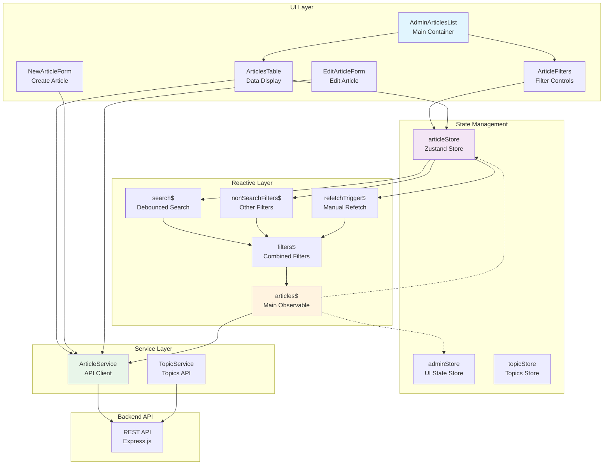

# Articles Feature Architecture

## Overview
The Articles feature implements a sophisticated reactive architecture combining Zustand for state management with RxJS observables for reactive data flows. This document explains the complete architecture, data flow, and component interactions.

## Architecture Diagram



## Component Layer

### AdminArticlesList
**Purpose**: Main container component that orchestrates the articles management interface

**Responsibilities**:
- Subscribes to the `articles$` observable
- Renders header with "New Article" action
- Contains `ArticleFilters` and `ArticlesTable` components
- Fetches topics on mount

**Key Code**:
```typescript
export function AdminArticlesList() {
  useObservableSubscription(articles$);  // Subscribe to reactive pipeline
  const { fetchTopics } = useTopicStore();
  
  useEffect(() => {
    fetchTopics();  // Load topics once
  }, [fetchTopics]);
}
```

### ArticleFilters
**Purpose**: Provides comprehensive filtering interface

**Features**:
- Search by title (debounced)
- Filter by topic (dropdown)
- Date range picker
- View count range
- Status filter (published/draft)
- Collapsible UI

**Integration**:
```typescript
const { filters, setFilters, clearFilters, showFilters, toggleFilters } = useStore();
// Updates trigger observable emissions → API calls
```

### ArticlesTable
**Purpose**: Displays articles with sorting, pagination, and actions

**Features**:
- Sortable columns (date, title, topic, views)
- Inline delete with confirmation
- Pagination controls
- Click-to-edit navigation
- Status badges (Published/Draft)

**Key Operations**:
```typescript
const deleteArticle = async (id: string) => {
  await ArticleService.deleteArticle(id);  // Direct service call
  refetch();  // Trigger data refresh
};
```

## State Management Layer

### articleStore (Zustand)
**Purpose**: Central state management for articles data and filters

**State Structure**:
```typescript
interface ArticleState {
  // Data
  articles: Article[];
  pagination: { page, limit, total, totalPages, hasMore };
  filters: ArticleFilters;
  refetchTrigger: number;
  
  // Actions (synchronous only)
  updateArticle: (id, article) => void;
  setFilters: (filters) => void;
  setPage: (page) => void;
  setSort: (field, order) => void;
  refetch: () => void;  // Increments trigger
}
```

**Key Design Decisions**:
- No async operations in store
- Store is purely for state management
- Refetch mechanism via trigger increment

### adminStore
**Purpose**: UI-level state management

**State**:
```typescript
{
  error: string | null;
  showFilters: boolean;
}
```

## Reactive Layer (RxJS Observables)

### Observable Pipeline Architecture

```
Store Changes → Observables → Debounce → Combine → Fetch → Update Store
```

### Key Observables

#### search$
```typescript
const search$ = store$.pipe(
  map(state => state.filters.search),
  distinctUntilChanged(),
  debounceTime(500)  // Debounce user input
);
```

#### nonSearchFilters$
```typescript
const nonSearchFilters$ = store$.pipe(
  map(state => /* all filters except search */),
  distinctUntilChanged(),
  debounceTime(500)
);
```

#### filters$
```typescript
const filters$ = combineLatest([
  combineLatest([search$, nonSearchFilters$]),
  refetchTrigger$
]).pipe(
  map(([filters, trigger]) => ({ filters, trigger })),
  distinctUntilChanged()
);
```

#### articles$ (Main Pipeline)
```typescript
export const articles$ = filters$.pipe(
  tap(() => useAdminStore.getState().clearError()),
  switchMap(({ filters }) => ArticleService.getArticles(filters)),
  tap(result => {
    useArticleStore.setState({
      articles: result.data,
      pagination: result.pagination
    });
  }),
  catchError(error => {
    useAdminStore.getState().setError(error.message);
    return [];  // Keep stream alive
  })
);
```

### Observable Features
- **Debouncing**: Prevents excessive API calls
- **Distinct Until Changed**: Eliminates duplicate emissions
- **Switch Map**: Cancels previous requests automatically
- **Error Recovery**: Stream continues after errors
- **State Updates**: Automatic store updates via tap

## Service Layer

### ArticleService
**Purpose**: HTTP client abstraction for article operations

**Methods**:
```typescript
class ArticleService {
  static async getArticles(filters: ArticleFilters): Promise<PaginatedResponse>
  static async getArticle(id: string): Promise<Article>
  static async createArticle(data: Partial<Article>): Promise<Article>
  static async updateArticle(id: string, data: Partial<Article>): Promise<Article>
  static async deleteArticle(id: string): Promise<void>
}
```

**Features**:
- Centralized error handling
- Response transformation
- Type safety with generics
- Environment-based API URL

## Data Flow Patterns

### 1. Filter Change Flow
```
User types in search
    ↓
setFilters() called
    ↓
Store updates filters
    ↓
search$ observable emits
    ↓
Debounced for 500ms
    ↓
filters$ combines all filters
    ↓
articles$ receives new filters
    ↓
switchMap cancels old request
    ↓
ArticleService.getArticles() called
    ↓
Response updates store
    ↓
UI re-renders with new data
```

### 2. Delete Article Flow
```
User clicks delete
    ↓
Confirmation dialog
    ↓
ArticleService.deleteArticle(id)
    ↓
API call completes
    ↓
refetch() called
    ↓
refetchTrigger incremented
    ↓
filters$ emits (same filters, new trigger)
    ↓
articles$ fetches fresh data
    ↓
Store updated with new list
```

### 3. Create/Edit Article Flow
```
User submits form
    ↓
ArticleService.create/updateArticle()
    ↓
API call completes
    ↓
Navigate to articles list
    ↓
Observable fetches latest data
```

## Key Architecture Decisions

### 1. Separation of Concerns
- **Components**: UI rendering and user interaction
- **Stores**: State management only (no async)
- **Services**: API communication
- **Observables**: Reactive data flow orchestration

### 2. Reactive vs Imperative
- **Reactive**: Data fetching, filtering, real-time updates
- **Imperative**: CRUD operations, navigation

### 3. Performance Optimizations
- **Debouncing**: 500ms on all filter inputs
- **Request Cancellation**: Via switchMap
- **Single Request on Mount**: No startWith() duplication
- **Distinct Emissions**: Prevent unnecessary re-fetches

### 4. Error Handling Strategy
- Service level: Throws structured errors
- Observable level: Catches and logs, keeps stream alive
- Component level: Shows user-friendly messages

## Type Safety

### Shared Types
All types are defined in `@singularity-news/shared`:
```typescript
interface Article {
  id: string;
  title: string;
  content: string;
  topic: string;
  views: number;
  published: boolean;
  createdAt: string;
  // ...
}

interface ArticleFilters {
  search?: string;
  topic?: string;
  startDate?: string;
  endDate?: string;
  minViews?: number;
  maxViews?: number;
  sortBy?: string;
  sortOrder?: 'ASC' | 'DESC';
  limit?: number;
  offset?: number;
}
```

## Best Practices Implemented

1. **No Async in Stores**: Stores are synchronous only
2. **Single Source of Truth**: Server state via observables
3. **Optimistic Updates**: Not implemented (could be added)
4. **Request Deduplication**: Via distinctUntilChanged
5. **Loading States**: Removed to maintain UI responsiveness
6. **Error Boundaries**: Global error handling in observables

## Future Enhancements

### Potential Improvements
1. **Optimistic Updates**: Update UI before server confirms
2. **Caching**: Add caching layer to reduce API calls
3. **Websocket Integration**: Real-time updates
4. **Virtual Scrolling**: For large article lists
5. **Bulk Operations**: Select multiple articles for actions
6. **Undo/Redo**: Action history management

### Scalability Considerations
- Current architecture handles 1000s of articles well
- Pagination prevents memory issues
- Debouncing protects backend from overload
- Observable patterns scale horizontally

## Testing Strategy

### Unit Testing
- Test stores in isolation
- Mock services for component tests
- Test observables with marble testing

### Integration Testing
- Test complete data flow
- Mock API responses
- Test error scenarios

### E2E Testing
- Test user workflows
- Verify filter combinations
- Test CRUD operations

## Conclusion

The Articles feature demonstrates a sophisticated reactive architecture that:
- Provides excellent user experience with responsive filtering
- Maintains clean separation of concerns
- Scales well with growing data
- Handles errors gracefully
- Ensures type safety throughout

The combination of Zustand for simple state management and RxJS for complex async flows creates a powerful and maintainable architecture suitable for enterprise-level applications.